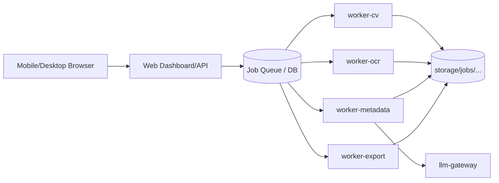

# Caipture

Caipture is a local-first, service-oriented pipeline for digitizing historical photographs and generating structured metadata with provenance and review support.

## Architecture Diagram



## Implemented PoC Components

- `services/web`: JSON API and monitoring dashboard
- `services/worker-cv`: validation + subject-image derivative generation
- `services/worker-ocr`: OCR artifact generation (deterministic PoC surrogate)
- `services/worker-metadata`: canonical metadata generation and review decision
- `services/worker-export`: export file + sidecar generation
- `services/llm-gateway`: constrained model-gateway abstraction
- `src/caipture`: shared contracts, queue, storage, pipeline logic

## Requirements
- Written for macOS/Linux 
- `podman` installed
- `docker` installed
- `python` installed

## Configuration

Runtime behavior is parameterized via JSON config files:

- `deploy/configs/dev/config.json`
- `deploy/configs/rpi/config.json`

Set config explicitly:

```bash
export CAIPTURE_CONFIG=deploy/configs/dev/config.json
```

### Web Hosting Configuration

Web host/port can be configured in config file under `web.host` and `web.port`, or overridden by environment variables:

- `CAIPTURE_WEB_HOST`
- `CAIPTURE_WEB_PORT`

LAN/mobile access:

- default dev bind address is `0.0.0.0:8080`
- from the same local network, open `http://<your-computer-lan-ip>:8080/` on phone/other device

## Web Access and Monitoring

When the web service is running:

- Monitoring dashboard (HTML): `GET /`
- Monitoring data (JSON): `GET /monitoring`
- Health probe: `GET /health`
- Job status: `GET /jobs/<job_id>`

Dashboard includes:

- status of services
- status of applications
- LLM usage since session start
- process counts (running/finished/aborted/possible queue)
- system load
- per-service process load bars (CPU/RSS)
- review queue with web approve actions
- recent central journal actions

Monitoring behavior is configurable via `monitoring` section in config:

- `runtime_dir`
- `llm_gateway_health_url`
- `refresh_seconds`

### Web Upload Flow

Open `http://127.0.0.1:8080/` and use **Upload Via Web Page** form:

1. Select subject image.
2. Optionally select back and context images.
3. Optionally provide manual date/location/comment when no back image is available.
4. Submit form.
5. Approve `review_required` jobs from **Jobs Queue and Approval**.
6. Preview export image and metadata inline on the dashboard.
7. Track actions in **Recent Journal Actions** (newest first).

### Central Journal (debug)

All runtime actions are appended to:

- `storage/runtime/journal.jsonl`

## Local Run (without containers)

Start all services:

```bash
scripts/dev/start_all.sh
```

Stop all services:

```bash
scripts/dev/stop_all.sh
```

### Upload a job

```bash
PYTHONPATH=src python3 -m caipture.cli --config deploy/configs/dev/config.json \
  upload --subject /path/to/subject.png --back /path/to/back.png \
  --manual-date 1954-07-12 --manual-location \"Enschede\" --manual-comment \"Family portrait\"
```

### One-shot pipeline execution

```bash
scripts/dev/run_pipeline_once.sh
```

### Approve review and export

```bash
PYTHONPATH=src python3 -m caipture.cli --config deploy/configs/dev/config.json \
  review-approve --job-id <job_id> --approved-by <name>
PYTHONPATH=src python3 -m caipture.cli --config deploy/configs/dev/config.json run-export-once
```

## Container Run (Podman Compose)

```bash
scripts/dev/compose_up.sh
scripts/dev/compose_down.sh
```

## Tests

Unit + integration tests:

```bash
scripts/test/run_all.sh
```

BDD integration tests (Cucumber/Gherkin using `behave`):

```bash
scripts/test/run_bdd.sh
```

## Notes

Current implementation details:

- CV stage uses ImageMagick (`magick`) for auto-trim crop and resize.
- OCR stage uses `tesseract` CLI (sidecar `.txt` remains supported for deterministic tests).
- LLM gateway logic is enabled by default in config and contributes metadata descriptions.
- Export stage writes contextual comment metadata and aligns output file timestamp to inferred historical date when available.

## Security and Data Flow

Caipture is designed as a local-first pipeline:

- Uploaded images are stored on local disk under `storage/jobs/<job_id>/inputs`.
- CV/OCR/metadata/export artifacts are generated locally under the same `storage/jobs/<job_id>` tree.
- Runtime logs and metrics are local files under `storage/runtime/` (including `journal.jsonl`).
- OpenCV (`cv2`), ImageMagick (`magick`), and Tesseract (`tesseract`) run as local processes on your machine; data is not sent to those tools externally.
- LLM gateway behavior is controlled by config (`metadata.enable_llm_gateway`). In this PoC it is local deterministic logic; if replaced with a remote provider later, OCR/context text and derived prompts could leave the host. Keep it disabled for strict local-only operation.
- The web dashboard exposes job and metadata state over HTTP on configured host/port. For LAN hosting, assume anyone on that network with access can view dashboard data unless you add network controls/reverse proxy auth.

<!-- BEGIN IMPORTED SERVICE READMES -->

## Imported Service READMEs

This section is generated by `scripts/dev/sync_root_readme.py`.

### Source: `services/web/README.md`

# Web Service (`services/web`)

## Purpose

Provides the local operator interface and API entrypoint for Caipture.

Core responsibilities:

- host dashboard UI (`/`)
- accept subject/back/context uploads via web form and JSON API
- expose monitoring and process state
- allow approving and deleting jobs from queue widget
- provide preview and download links for generated export image and metadata

## Network Hosting

- host/port come from config `web.host` and `web.port`
- defaults are intended for LAN access in dev (`0.0.0.0:8080`)

## Main Endpoints

- `GET /` full dashboard UI (dark mode + modal state viewer)
- `GET /monitoring` full monitoring payload (JSON)
- `GET /journal` central journal entries (JSON)
- `GET /health` health probe
- `GET /jobs/<job_id>` job state (JSON)
- `GET /process/<service_name>` service process state (JSON)
- `GET /download/<job_id>/image` download generated image
- `GET /download/<job_id>/sidecar` download metadata sidecar
- `GET /preview/<job_id>/image` inline image preview fragment (HTML)
- `GET /preview/<job_id>/metadata` metadata preview (JSON)
- `POST /upload-web` multipart form upload
- `POST /upload` JSON upload API
- `POST /approve-web` approve review-required job
- `POST /delete-web` delete job + remove artifacts
- `POST /run-all-once` run one processing sweep

## Runtime Data

- reads/writes under `storage/`
- central journal: `storage/runtime/journal.jsonl`

## Run

```bash
PYTHONPATH=src CAIPTURE_CONFIG=deploy/configs/dev/config.json python3 services/web/server.py
```

### Source: `services/worker-cv/README.md`

# CV Worker (`services/worker-cv`)

## Purpose

Processes uploaded subject image into corrected output artifacts.

Core steps:

- validate basic image quality constraints
- detect photo boundary/shape
- crop original photo from full upload
- apply perspective correction where detectable
- resize to configured output bounds

## Implementation

- preferred path uses OpenCV contour + perspective transform
- fallback path uses ImageMagick trim/resize
- artifacts:
  - `derived/front_cropped.png`
  - `derived/front_rectified.png`
  - `derived/validation_report.json`

## Run

```bash
PYTHONPATH=src python3 services/worker-cv/main.py
```

### Source: `services/worker-ocr/README.md`

# OCR Worker (`services/worker-ocr`)

## Purpose

Extracts text from back/context images and stores OCR artifacts for metadata stage.

## Implementation

- uses `tesseract` CLI for OCR
- runs multi-pass OCR (`psm_candidates`) and selects strongest result
- applies optional preprocessing variants for handwriting robustness (`enable_preprocessing`)
- computes confidence estimate from TSV output when available
- deterministic sidecar fallback (`<image>.txt`) remains enabled for tests
- if handwriting quality is poor, use manual context fields from upload form as first-class metadata evidence

Artifacts:

- `derived/back_ocr.txt`
- `derived/context_ocr.txt`
- `derived/context_ocr_###.txt` (one per context image)
- `derived/ocr_report.json`

## Run

```bash
PYTHONPATH=src python3 services/worker-ocr/main.py
```

### Source: `services/worker-metadata/README.md`

# Metadata Worker (`services/worker-metadata`)

## Purpose

Builds canonical metadata from CV/OCR evidence and review policy.

## Responsibilities

- fuse OCR evidence from back and all context artifacts
- parse OCR evidence for date/location/people/event/context
- call LLM gateway abstraction for additional description
- populate canonical metadata document
- compute review-required state and reasons

Primary output:

- `storage/jobs/<job_id>/metadata/photo_item.json`

## Run

```bash
PYTHONPATH=src python3 services/worker-metadata/main.py
```

### Source: `services/worker-export/README.md`

# Export Worker (`services/worker-export`)

## Purpose

Generates final export artifacts from approved metadata.

## Responsibilities

- copy/write final export image
- include export mapping fields (date/location/comment context)
- set file timestamp from inferred historical date when available
- write sidecar metadata JSON

Artifacts:

- `exports/photo_export.png`
- `exports/photo_export.sidecar.json`

## Run

```bash
PYTHONPATH=src python3 services/worker-export/main.py
```

### Source: `services/llm-gateway/README.md`

# LLM Gateway (`services/llm-gateway`)

## Purpose

Single abstraction point for model-assisted metadata interpretation.

## Responsibilities

- normalize/sanitize model requests
- return structured summary fields to metadata worker
- keep model interactions controlled and observable

## Current PoC behavior

- local deterministic summary behavior
- usage counters are tracked in session metrics and surfaced on dashboard

## Run

```bash
PYTHONPATH=src python3 services/llm-gateway/main.py
```

<!-- END IMPORTED SERVICE READMES -->
